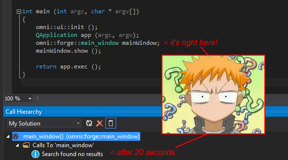

# Motivation for the Omni Programming Language

There are a few things about each programming language that I ever came across that are are not quite optimal in regards to efficient coding. I noticed that much of the time spent coding is doing one of these things, which are totally unproductive, anti-creative and dull. And for companies, they cost money. A lot of money, actually.

Why are there these dull tasks and, most of all, why doesn't anybody complain about them? They are just taken for granted as long as the punchcard era ended. And sometimes these tasks are not only dull, but even risky.

## File and directory handling

This might sound a bit strange. We have grown so accustomed to dealing with files and directories that we do not notice how much time is spent doing so. Adding files, renaming them, moving them to different directories, removing them from the file system and the version control.

If you pay attention to it, you will notice that there will be a considerable amount of minutes spent on these tasks when coding.

## Coding styles

Have you ever had an argument with your co-worker, or open source project team member, about a whitespace in your code? Or whether to put the *{* on the same or on the start of the next line of a function header?

I have worked at two companies by now (yes, that is not much, but I am loyal :D). Both didn't have style guides. I have seen serious social conflicts arise from __missing or too much whitespace__ or incorrect capitalization. Really, programmers get upset about that kind of stuff.

Have you ever worked on an aged project where your day-to-day source files are neat and shiny, but every now and then you have to touch a behemoth of the past where the fun stops the second you open and look at the source format?

It does really sound strange for non-programmers, but uniform code formatting and coding style is extremely important for a team. It makes the team feel closer together if the work of others doesn't look alien to you. And is has a big impact on team spirit.

## No automation

Most languages are not easy to parse yourself and/or there are no libraries to do so. (btw: [clang](http://clang.llvm.org "clang") and [Roslyn](http://msdn.microsoft.com/de-de/vstudio/roslyn.aspx "Roslyn") are a big improvement in this regard.)

This has the consequence that automating tasks for these languages is not possible in a correct, error-free way. There are many tools that try to accomplish some of these tasks, and many fail - especially for C++. 

There are many use-cases for automated language analysis and manipulation that could make the life of coders easier and provide them with much more efficiency:

* Code browsing. This works in most languages with a supporting IDE. But often it is not working all of the time. Especially when you really need it.
* Check, enforce or automatically apply a team's coding guidelines.
* Refactor code. Including - but not limited to - these tasks:
 * Rename elements (classes, methods, variables, etc.)
 * Extract, combine and move methods
 * Add, remove or reorder parameters
* Find code smells, such as code duplication.
* Check for logical errors - knowing your classes and their semantics, you could run algorithms on your codebase - if you just could access it.

  

## Only little guiding

As presented in this excellent [article from Glen Chiacchieri](http://glench.com/LegibleMathematics/), we programmers are still quite left on our own when it comes to understanding our program logic. The presentation of the code and code flow is bare to the metal, there is no feedback so that we can see and feel how our code works. Swift has done a nice job (in theory, have not yet used it in practice) with it's [Playground](https://www.youtube.com/watch?v=vogFSIxprUo). But we programmers deserve so much better, for much more complex situation. I have seen it dozens and hundreds of times that really excellent programmers are stuck on a bug with a simple misplace paranthesis, minus sign or something trivial like this. This waste of time should never, ever happen.

## Your code is your master

A large codebase is predetermined to have at least a few 'legacy' parts. Sometimes these are even the core parts, because it was found too risky to refactor or redesign the core. The larger a part of your codebase grows, the harder it will be to refactor and it will most likely become legacy code that most developers don't feel comfortable modifying or extending. Sometimes this state spreads across the whole codebase, even infesting relatively fresh parts, because they all have to interface to the legacy code.

That's one scenario that can lead to a codebase that no longer allows flexible modification or extension. There are more reasons a codebase can become like this. And all reasons have to do with the cost of keeping your codebase modern. And the cost is so high because programming languages are not designed to be understood and modified by programs. Code scattered across hundreds and thousands of files, complex build rules, dozens of different build tools and a bunch of compiler switches that automatization usually does not know about are a few reasons why the cost is so high. And it grows exponentially.

__It often just feels like your code base owns you, not the other way around.__

## Do you have conflicts?

Especially when combined with regular refactoring, version control systems give you conflicts. Even if it's superb like git, or solid like svn. I have learned that except for the most experienced programmers, even the smallest merge-conflicts troubles developers. And those troubles lead to incorrectly merged code, which in turn leads to bugs or compiler and linker errors (which is another beast that many can not tame).

## That lib is awesome! Just not for me

Do you know the feeling when searching for a library that does ABC, and you find something that __exactly__ meets your requirements - just to find out it is written in R. Or in Ruby and you are a Java programmer. Or in Java and you are a Ruby programmer. This really sucks, and it decreases productivity (which hurts companies) and slows down overall progress in all kinds of fields, especially in computer sciences. 

## That job is awesome! But they will not take me

You are a Java guru. You have worked with everything that has ever been done in Java, know the standard in and out, every library out there - actually, every second library out there is written by you. And then there is that company that you would totally love to work at. They are smart, they are creative, have high salaries and the product is pure awesome.

You have __no chance to get the job__, though. The product's front-end is written in JavaScript with Angular and the backend is written in Lisp. If you apply with umpteenth years of just Java experience, your application will be filtered out by HR as "not a technical fit". 

## Can't stand it any more

Just as Uncle Bob thoroughly explains in his keynote "[The Last Programming Language](https://cleancoders.com/episode/clean-code-the-last-programming-language/show "The Last Programming Language")" (sorry for the paywall, but it's really worth the $ 2,00), it is finally time that the programming industry decides on ONE programming language that should be used, instead of [122 and more](http://en.wikipedia.org/wiki/Comparison_of_programming_languages).

Omni aims to be that language. Yes, we could use something that is already out there and enhance it. As you will see later, Omni is different in a kind that does not allow this to happen. Instead, Omni will have glue to import and export code from/to the most common languages, which will make it the de-facto standard if you want to transfer a library from language A to language B. (Or you drop using language B altogether and use Omni instead!)

And not only that. I want to give you the control over your codebase. Access to the full code model. Absolutely exact, error-free and instant. You can automate everything you can imagine. You can make it look just like you or your company want it.

Want to check whether there are pointers used without prior check for null? Do it. It's not more than 5 minutes. On a 10 million lines of code project. Want to change that and put a *if (foo != null)* in front of the pointer's usage? Maybe another 5 minutes.

Add classes, methods and members, refactor, move code, redesign code, update coding guidelines, work heavily with 20 programmers on the same code branch with regular commits without having to worry about conflicts. This is what should really be the meaning of "Extreme Programming" or "Agile".
