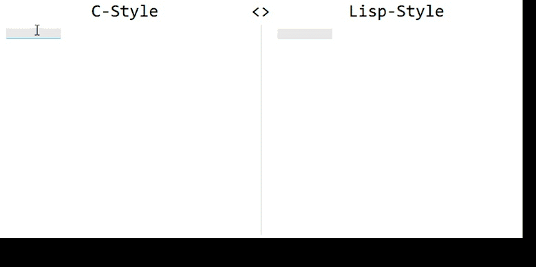
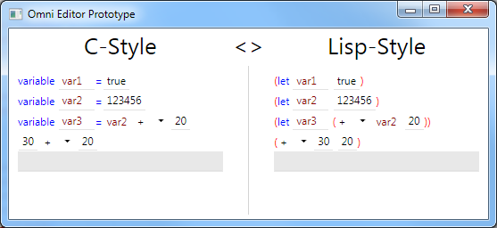

**INFO** _My efforts around Omni have been on hold for a long time and will be for the foreseeable future - mostly because my kids keep me busy :-) In the meantime, a few other projects spawned and have made progress, that I would like to mention:_

* [isomorƒ|https://isomorf.io/]
* [Unison|http://unisonweb.org/]
* [Expressions of Change|http://www.expressionsofchange.org/]
* [Codeflow|http://codeflow.co/]
* [Luna|http://www.luna-lang.org/]

# The Omni Programming Language Manifest

This manifest declares goals that The Omni Programming Language is designed to reach.
Omni is meant to provide a new way of coding. A way of coding where less time is spent on text editing and more time spent on engineering, designing, defining and changing logic and architecture, assuring quality and documenting.

In short, Omni frees the programmer of unnecessary tasks that the classic way of writing programs in text files imposes on them to let you get things done.

# Goals

## Productivity

Higher productivity and quality for programmers

* Let programmers focus on coding
* Let programmers create higher quality and more robust code, with less effort
* Integrated backlogs and work tasks

## Agility
 
* Make wide-scale code changes *safe*, fast and easy
* Make code easier to refactor
* Make code easier to be statically analysed
* Make code easier to be automatically manipulated

## Quality 
 
* Integrated unit tests
* Integrated test director
* Integrated documentation system

## Technology

* Code is not stored in text files, but in a database
* This enables Omni to present code pieces independent of their physical storage
* Declarative and imperative code model in the same language
* Deterministic Garbage Collector via Automatic Reference Counting
* API to access the code model (for coded refactoring, analysis, metrics, reports, etc.)
* Built-in, compile-time-safe multithreading

# Further readings

- [Motivation](Motivation.md "Motivation")
- Technology (Coming soon)
- Vision (Coming soon)

# Status quo

Update: 15.05.2017

After 2 years of hibernation, I returned to working on this project. I took the time to follow current development trends, see all the hilarious rise and fall of JavaScript-languages / Web Frontend Frameworks and contemplating about whether I should build Omni as an on-premise desktop software or an online SaaS.

I finally concluded that a web based approach is more suitable to the current direction of the Developer Ecosystem and Communities. I re-started work on Omni using [Elm](http://elm-lang.org/) as a Front End language/framework and was somewhat surprised. [The Elm Architeture](https://guide.elm-lang.org/architecture/) actually will make implement Omni *much easier* than my last approach using WPF, and even more robust! I am very pleased with what I have seen and learned so far and am currently investigating Backend solutions. (I tried [ASP.NET Core](https://www.asp.net/), with which I already have experience, and am installing Scala, sbt and [Play](https://www.playframework.com/) right now. I'd like to have a "mainstream" functional language in the backend, to make contributions more accessible.)

I'll post an update as soon as I have a similar prototype ready to what you can see in WPF below.

Update: 23.06.2015

More work on the input system Prototype, looks good so far. Well, not exactly pretty, but the mechanics are sound.
Look at this awesome stuff:

Update: 10.06.2015

The progress on the Prototype is coming along nicely. I chose to implement the prototype in C#, because a) I am much faster in GUI coding in C# + WPF than in C++ with Qt (but can't use it for the final product because it is not cross-platform) and b) I will not be able to copy+paste quick&dirty-code from the prototype to the production code. Here's a small teaser:

  

Just for kicks, I hooked up two views that display the same code model with different templates. This way you can synchronously edit the same code in C-style and in Lisp-style. Feels awesome!

Update: 02.06.2015

I have made progress on a prototype for the input architecture. This is not trivial, but I might be able to show a small sneak preview soon.

Update: 13.05.2015

I haven't been working much on th code base lately, because my primary goal was to get portability before driving features. I have ported the build system to CMake and Omni now builds on Win32 and Linux on x86, x86_64 and ARM v7 (using a Raspberry Pi as a development platform).

There is even a little bi GUI up and running (on all platforms). I have built a few input fields for literal expressions and variable definitions. I am not very happy with the result, though - both the code architecture and the look&feel.

So I decided to do some backend work, which currently consists mainly of reseach, hence little code changes. I am trying to integrate either static code analysis or automatic unit test generation to Omni, so I am currently looking around to see what has already been done. My plan is to update the Wikipedia article to include a comprehensive feature comparison of C++ Static Code Analysis tools.

Omni is going slow-paced, because I don't find much time to work on it. But this gives me the time to build up the ideas and the big picture in my mind before hacking away. :-)

Update: 04.11.2014

Currently, the code model exists for basic structures such as functions, variables, if/for/while/etc. and can be compiled to binaries on Win32 and Linux.
A flexible meta-information system that allows you to attach any kind of information to entity types (expressions and statements) is finished and used to combine the code model and the UI.
There are some little prototypes for the UI to edit and view elements such as literals and variable declarations. The next step will be a "free-form" input field that automatically detects the type of entity that is being written and auto-transforms in that entity's special ui. E.g. when I write "va", it auto-expands to the UI for variable declarations, looking like "var [variable-name] = [init-expression]".
In parallel, I am writing the docs "Motivation" and "Technology". "Vision" is to follow.
